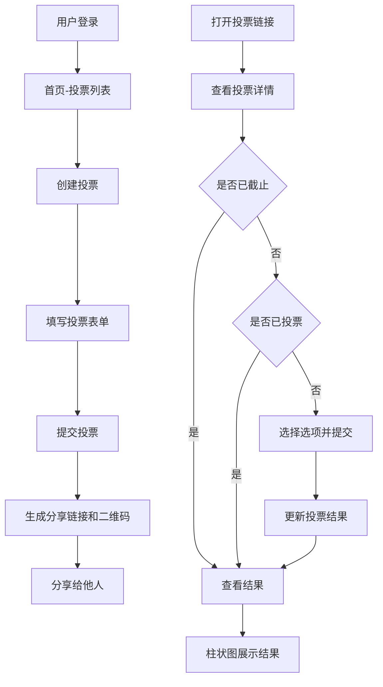

## 1. 产品概述

在线投票系统是一个基于 Web 的投票平台，用户可以创建投票、分享投票链接、参与投票，并实时查看投票结果。系统支持单选和多选两种投票类型，通过邮箱注册登录确保每人每票限投一次。

- 主要用途：快速创建和分发在线投票，收集用户意见
- 目标用户：需要进行投票调研的个人、团队和组织
- 核心价值：简单易用、实时统计、安全防刷

## 2. 核心功能

### 2.1 用户角色

| 角色 | 注册方式 | 核心权限 |
|------|----------|----------|
| 普通用户 | 邮箱注册登录 | 创建投票、参与投票、查看投票结果 |

### 2.2 功能模块

1. **首页/投票列表**：展示用户创建的投票，快速创建投票入口
2. **创建投票页**：设置投票标题、选项（2-10个）、截止时间、投票类型（单选/多选）
3. **投票详情页**：展示投票信息、参与投票、实时显示结果（柱状图）
4. **投票分享页**：展示投票链接和二维码，方便分享给他人
5. **登录/注册页**：邮箱密码注册登录

### 2.3 页面详情

| 页面名称 | 模块名称 | 功能描述 |
|----------|----------|----------|
| 首页 | 投票列表 | 展示用户创建的所有投票，显示标题、状态、截止时间 |
| 首页 | 创建按钮 | 快速跳转到创建投票页面 |
| 创建投票页 | 表单模块 | 输入标题、添加/删除选项（2-10个）、选择投票类型、设置截止时间 |
| 创建投票页 | 提交按钮 | 创建投票并跳转到分享页面 |
| 投票详情页 | 投票信息 | 显示标题、创建者、截止时间、剩余时间 |
| 投票详情页 | 选项列表 | 单选/多选投票选项，提交投票 |
| 投票详情页 | 结果图表 | 柱状图展示各选项得票数和百分比 |
| 投票分享页 | 链接展示 | 显示投票链接，支持一键复制 |
| 投票分享页 | 二维码 | 展示投票页面的二维码图片 |
| 登录页 | 登录表单 | 邮箱密码登录 |
| 注册页 | 注册表单 | 邮箱密码注册 |

## 3. 核心流程

用户创建投票：登录 → 点击创建投票 → 填写投票信息 → 提交 → 生成分享链接和二维码 → 分享给他人

用户参与投票：打开投票链接 → 查看投票信息 → 选择选项 → 提交投票 → 查看实时结果

## 4. 用户界面设计

### 4.1 设计风格

- **主色调**：深海蓝 (#1e40af) 作为主色，搭配青蓝色 (#0ea5e9) 作为强调色
- **背景**：浅灰渐变背景，卡片式布局
- **按钮风格**：圆角按钮，悬停有阴影和微动效
- **字体**：现代无衬线字体，标题使用加粗字体
- **布局风格**：卡片式布局，居中对齐，干净简洁
- **图标风格**：线性风格图标，简洁明了

### 4.2 页面设计概述

| 页面名称 | 模块名称 | UI 元素 |
|----------|----------|---------|
| 首页 | 投票列表 | 卡片式列表，每个卡片显示标题、状态标签、截止时间、参与人数 |
| 创建投票页 | 表单 | 大输入框，选项可动态增减，日期选择器，单选多选切换 |
| 投票详情页 | 选项 | 选项卡片式设计，选中有高亮效果，进度条动画 |
| 投票详情页 | 图表 | 彩色柱状图，带动画效果，显示票数和百分比 |
| 分享页 | 二维码 | 居中展示二维码，下方有复制链接按钮 |

### 4.3 响应式设计

- 采用桌面端优先设计，移动端自适应
- 移动端单列布局，卡片占满宽度
- 触摸优化：增大点击区域，适合手指操作

### 4.4 动效设计

- 页面加载：元素渐入动画
- 投票提交：柱状图高度变化动画
- 按钮悬停：背景色过渡，轻微上浮
- 卡片悬停：阴影加深，轻微放大
