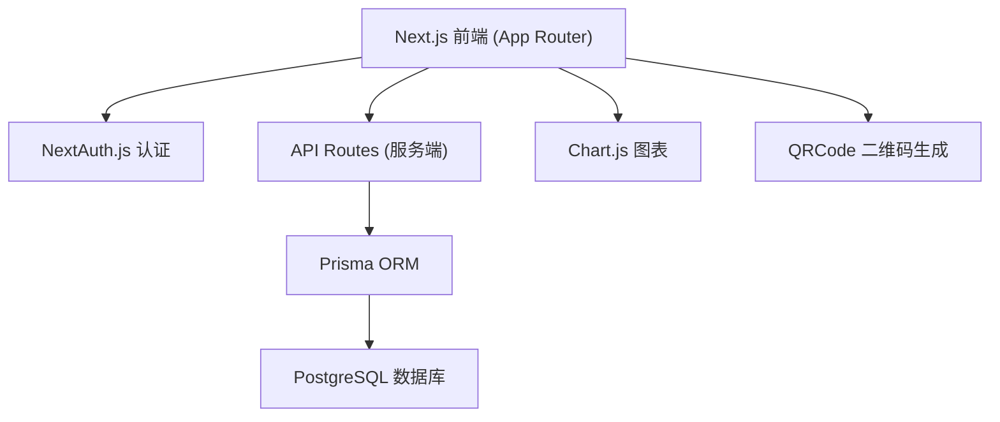
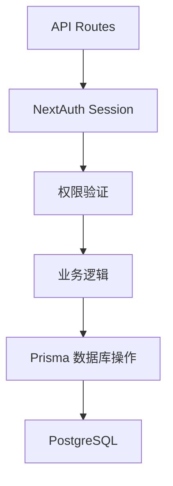
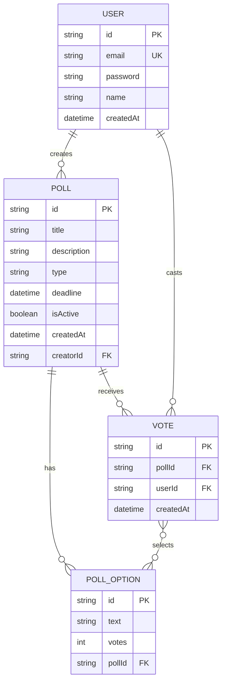

## 1. 架构设计



## 2. 技术栈说明

- **前端框架**：Next.js 14 (App Router) + React 18 + TypeScript
- **样式方案**：TailwindCSS 3
- **认证系统**：NextAuth.js (Credentials Provider 邮箱密码登录)
- **数据库**：PostgreSQL
- **ORM**：Prisma
- **图表库**：Chart.js + react-chartjs-2
- **二维码**：qrcode.react
- **密码加密**：bcryptjs
- **图标**：lucide-react

## 3. 路由定义

| 路由 | 页面 | 说明 |
|------|------|------|
| / | 首页/投票列表 | 展示用户创建的投票列表 |
| /polls/create | 创建投票 | 创建新投票表单 |
| /polls/[id] | 投票详情 | 投票详情页，参与投票和查看结果 |
| /polls/[id]/share | 分享页面 | 展示投票链接和二维码 |
| /login | 登录页 | 邮箱密码登录 |
| /register | 注册页 | 邮箱密码注册 |
| /api/auth/* | NextAuth API | 认证相关接口 |
| /api/polls | 投票列表 API | 获取/创建投票 |
| /api/polls/[id] | 投票详情 API | 获取投票详情 |
| /api/polls/[id]/vote | 投票 API | 提交投票 |

## 4. API 接口定义

### 4.1 类型定义

```typescript
interface User {
  id: string;
  email: string;
  name?: string;
  createdAt: Date;
}

interface PollOption {
  id: string;
  text: string;
  votes: number;
}

interface Poll {
  id: string;
  title: string;
  description?: string;
  type: 'single' | 'multiple';
  deadline: Date;
  isActive: boolean;
  createdAt: Date;
  creatorId: string;
  creator: User;
  options: PollOption[];
  totalVotes: number;
  hasVoted: boolean;
}

interface Vote {
  id: string;
  pollId: string;
  userId: string;
  optionIds: string[];
  createdAt: Date;
}
```

### 4.2 接口列表

| 接口 | 方法 | 描述 | 请求体 | 响应 |
|------|------|------|--------|------|
| /api/auth/register | POST | 用户注册 | { email, password, name } | { user } |
| /api/polls | GET | 获取投票列表 | - | { polls: Poll[] } |
| /api/polls | POST | 创建投票 | { title, options: string[], type, deadline } | { poll: Poll } |
| /api/polls/[id] | GET | 获取投票详情 | - | { poll: Poll } |
| /api/polls/[id]/vote | POST | 提交投票 | { optionIds: string[] } | { poll: Poll } |

## 5. 服务端架构



## 6. 数据模型

### 6.1 ER 图



### 6.2 Prisma Schema

```prisma
model User {
  id        String    @id @default(cuid())
  email     String    @unique
  password  String
  name      String?
  createdAt DateTime  @default(now())
  polls     Poll[]
  votes     Vote[]
}

model Poll {
  id          String        @id @default(cuid())
  title       String
  description String?
  type        String        // "single" | "multiple"
  deadline    DateTime
  isActive    Boolean       @default(true)
  createdAt   DateTime      @default(now())
  creatorId   String
  creator     User          @relation(fields: [creatorId], references: [id])
  options     PollOption[]
  votes       Vote[]
}

model PollOption {
  id     String @id @default(cuid())
  text   String
  votes  Int    @default(0)
  pollId String
  poll   Poll   @relation(fields: [pollId], references: [id], onDelete: Cascade)
}

model Vote {
  id         String       @id @default(cuid())
  pollId     String
  userId     String
  createdAt  DateTime     @default(now())
  poll       Poll         @relation(fields: [pollId], references: [id], onDelete: Cascade)
  user       User         @relation(fields: [userId], references: [id])
  optionVotes OptionVote[]
}

model OptionVote {
  id         String     @id @default(cuid())
  voteId     String
  optionId   String
  vote       Vote       @relation(fields: [voteId], references: [id], onDelete: Cascade)
  option     PollOption @relation(fields: [optionId], references: [id], onDelete: Cascade)
}
```

## 7. 项目目录结构

```
.
├── prisma/
│   └── schema.prisma
├── src/
│   ├── app/
│   │   ├── layout.tsx
│   │   ├── page.tsx              # 首页
│   │   ├── login/
│   │   │   └── page.tsx          # 登录页
│   │   ├── register/
│   │   │   └── page.tsx          # 注册页
│   │   └── polls/
│   │       ├── create/
│   │       │   └── page.tsx      # 创建投票
│   │       └── [id]/
│   │           ├── page.tsx      # 投票详情
│   │           └── share/
│   │               └── page.tsx  # 分享页面
│   ├── components/
│   │   ├── PollCard.tsx
│   │   ├── PollForm.tsx
│   │   ├── VoteChart.tsx
│   │   ├── Navbar.tsx
│   │   └── QRCodeDisplay.tsx
│   ├── lib/
│   │   ├── prisma.ts
│   │   ├── auth.ts
│   │   └── utils.ts
│   ├── types/
│   │   └── index.ts
│   └── api/
│       ├── auth/
│       │   └── [...nextauth]/route.ts
│       ├── register/route.ts
│       └── polls/
│           ├── route.ts
│           └── [id]/
│               ├── route.ts
│               └── vote/route.ts
```
